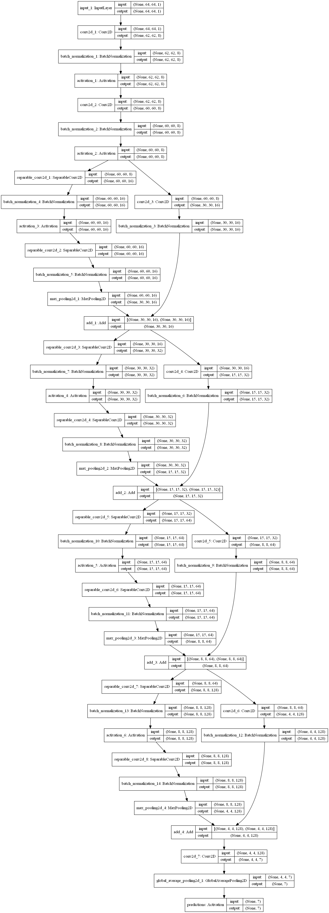
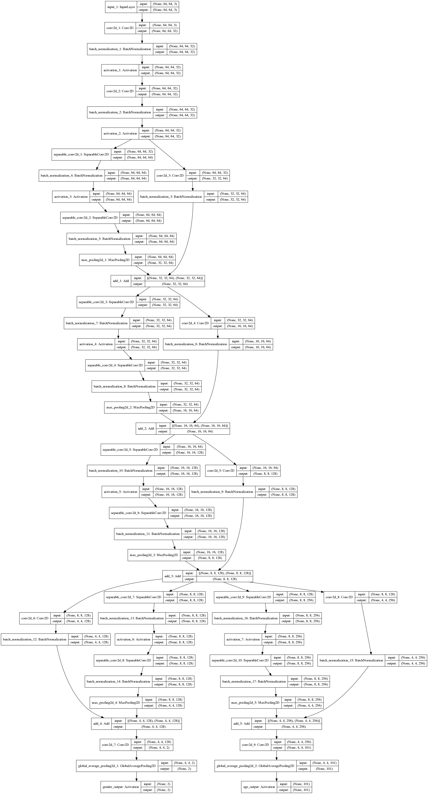
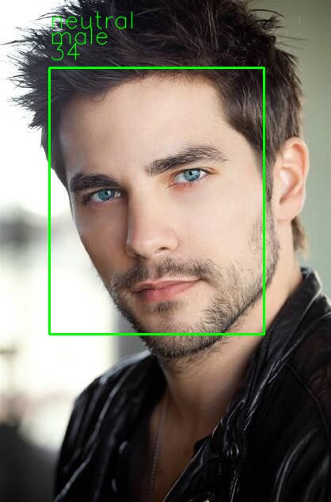

# classification
real-time face detection and emotion classification
* the test accuracy about emotion is 66% in the kaggle competion dataset fer2013
* the test accuracy about gender is 90% in the wiki, but the test accuracy of age is very low
 ##dataset source:
 * fer2013:[0:'angry',1:'disgust',2:'fear',3:'happy', 4:'sad',5:'surprise',6:'neutral']
 * imdb-wiki: 
 * gender:[0:'female', 1:'male']   age:[0-100]
 
 ## classification emotion model use mini_XCEPTION
 
 ## classification gender_age model use mini_XCEPTION with two branches
 
 
 ## trainning
 * python src/train_emotion_classifier.py
 * python src/train_gender_age_classifier.py
 * notest: need to modify the data path when training
 
 ## test
 * python image_emotion_gender_age_predict.py

 
 ## Prerequisites
-------------
* Keras==2.3.1
* opencv-python==4.1.1.26
* tensorboard==1.14.0
* mtcnn==0.0.9
* numpy==1.16.0
* scikit-learn==0.21.3
* ...
